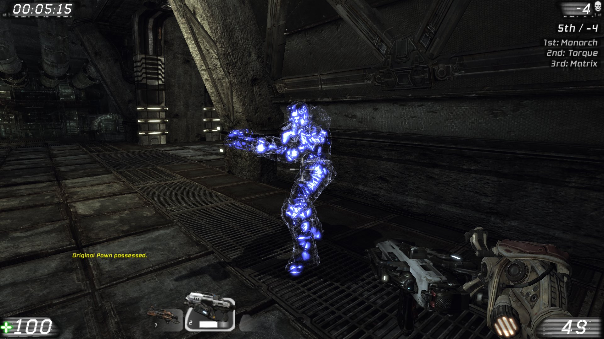

Safe Spawn
==========================

A concept for [Unreal Tournament](http://www.unrealtournament.com/) made for **Unreal Tournament 3** exchanging the stock spawn protection system with a *Ghost protection*.

__Features:__ 

 - Different protection system **without** being **invincible**
 - Allow killing by spawning into someones character (for fast recovery)
 - Ability to check your spawn spot and decide your route
 - Being able to choose when the protection ends and how to return (by picking up a weapon)
 - No damage and no momentum applied while being protected
 - Ambient sounds so other players can hear ghosts running around
 - Beginner friendly information on the HUD 
 - Fully configurable (client and serversided separately)
 - _..and more_

__What's the purpose of it?__  
It basically started as an idea to improve the spawn system as system spawn killing can happen in different gametypes and there is no proper way to deal with it. With this system, players being able to choose whether they want to be protected or not. Protected players are shown as **ghosts**. This ghost won't take any damage, nor any projectile or instant hit weapon can harm the player. The ghost protected players is still able to walk around the, use the map teleporters or lift and being able to pickup weapons. But once the player tries to shoot or picking up another weapon than the ones he's holding, the protection is not given anymore and the players joins as a real player without being a ghost anymore. At that time the general *spawn effect* is played with the normal spawn sound.


# Install

 - Download the lastest version
 - Extract the zip file to your UT3 folder. For instance:  
  `%userprofile%\Documents\My Games\Unreal Tournament 3\UTGame`  
  or manually move the content to the following subfolders:
- `UTUT4Proto_MutatorSafeSpawn.ini`to `.\Config`
- `UT4Proto_MutatorSafeSpawn.u`to `.\Published\Script`
- `UT4Proto_MutatorSafeSpawn.int`to `.\Published\Localization`

# Usage

Method 1:
 
 - Start the game
 - Add the mutator "UT4 Prototype: Safe Spawn (compatible)" or "UT4 Prototype: Safe Spawn (standalone)"
 - Enjoy.

Method 2:

 - Add this line to the command line arguments (or your shortcut, server command line, ...):
   `?mutator=UT4Proto_MutatorSafeSpawn.UT4SafeSpawnMutatorCompat`  
or  
   `?mutator=UT4Proto_MutatorSafeSpawn.UT4SafeSpawnMutatorStand`
 - Split multiple mutators by the character `,` (comma)
   
Method 3:

 - Open the *WebAdmin* interface
 - Navigate to the following address `/ServerAdmin/current/change`
 - Enable "UT4 Prototype: Safe Spawn (compatible)" or "UT4 Prototype: Safe Spawn (standalone)"
 - Click "Change game"
 - After the reload, the mutator will be active.


# Preview

## Screenshots

Helping message (player spawns in third person):


Timer with bar until respawn:


Additional spawn effect when protection ends (switch to first person):


Ghost as seen for other players (able to shoot and walk through):


## Video

You can check the video which demonstrate the basic functionality:  
https://www.youtube.com/watch?v=cjP1UGg9Vgo  
[](http://www.youtube.com/watch?v=cjP1UGg9Vgo)


# Configuration
You can configure the mutator in multiple ways. Either choose to edit the ini file, use the console commands or open the mutator page of the WebAdmin interface.

## Console commands

There are two main console commands to configure the mutator:

 1. `mutate SafeSpawn`
 2. `SafeSpawn`

The first command should be used for server settings. The latter command can be used for local settings in Instant-Action/Standalone or Listen-server games. Both command can be used like this:

    COMMAND [VARIABLE] [VALUE]

- Without any given parameter (if variable and value is **not given**), all config values will be shown
- Without a given **value**, a variable description and the specified value is shown 
- By providing a **variable** and a **value**, the config value of the specified variable is changed to the given value.

The are **3** server settings and **6** client settings. All these settings are changeable by the console command. If you are playing as client and want to change a server settings, you have to logged in as admin. You can still change settings with the 2nd command but these will only be changed on your local system for your local games.

__Server settings__:

Variable  | Values  | Description  | Explanation
--------- | ------- | ------------ | -----------
**GhostProtectionTime** | positive float value | Ghost Protection time | The amout of time a player is protected by being a ghost
**InitialFireDelay** | positive float value | Initial fire delay | The delay in seconds a player has to wait after being an active player before being able to shoot.
**AllowGhostFrag** | `0`/`1` | Allow Ghost frags | Whether to allow fragging enemy players by spawning inside their character

__Client settings__:

Variable | Values | Description | Explanation
-------- | ------ | ----------- | -----------
**SwitchToThirdPerson** | `0`/`1` | Switch to ThirdPerson | Whether to switch to third person once you spawn as a ghost. The view will be reverted if the time of the protection runs out
**ApplyPPEffects** | `0`/`1` | Apply PostProcessing effects | Whether to apply post-processing effect once you spawn as a ghost. This effect will desaturate the scene. The colors will be reverted if the time of the protection runs out."
**HideCrosshairTemporarely** | `0`/`1` | Hide crosshair | Whether to remove/hide the crosshair while being a ghost.
**ShowTime** | `0`/`1` | Show remaining time | Whether to show a formatted time if you are a ghost.
**BarTimeThreshold** | positive float value | Bar time threshold | The time for which the barshould be drawn. If the ghost protection last 8s for instance and this value is set to 5s, the bar will not be drawn the first 3s.
**WarningSound** | `0`/`1` | Play warning sound | Whether to play warning sounds when the protection is about to run out."


## INI file

The ini file contains every possible configuration. Open the `UTUT4Proto_MutatorSafeSpawn.ini`file and change the values. Before you attempt to save the modified file, be sure that no instance of UT3 is running otherwise the changes will be overwritten on closing UT3.

The following list contains the default config.

```
[UT4Proto_MutatorSafeSpawn.UT4SafeSpawnMutator]
GhostProtectionTime=6.000000
InitialFireDelay=0.000000

[UT4Proto_MutatorSafeSpawn.UT4SafeSpawn]
AllowGhostFrag=True
SwitchToThirdPerson=True
ApplyPPEffects=True
HideCrosshairTemporarely=True

[UT4Proto_MutatorSafeSpawn.UT4SafeSpawnInventory]
ShowTime=True
BarTimeThreshold=5.0
WarningSound=True
```


## WebAdmin

Open the WebAdmin interface and navigate to the WebAdmin section *Mutators* with the url appendix `/ServerAdmin/settings/mutators`, select "UT4 Prototype: Safe Spawn (compatible)" or "UT4 Prototype: Safe Spawn (standalone)" out of the selection box and wait until a new page is generated. This page allows you to change values on-the-fly.

The WebAdmin interface is only available for LAN/online games not Instant-Action. 

Only the server settings are listed.


# License
Available under [the MIT license](http://mths.be/mit).

# Author
RattleSN4K3
